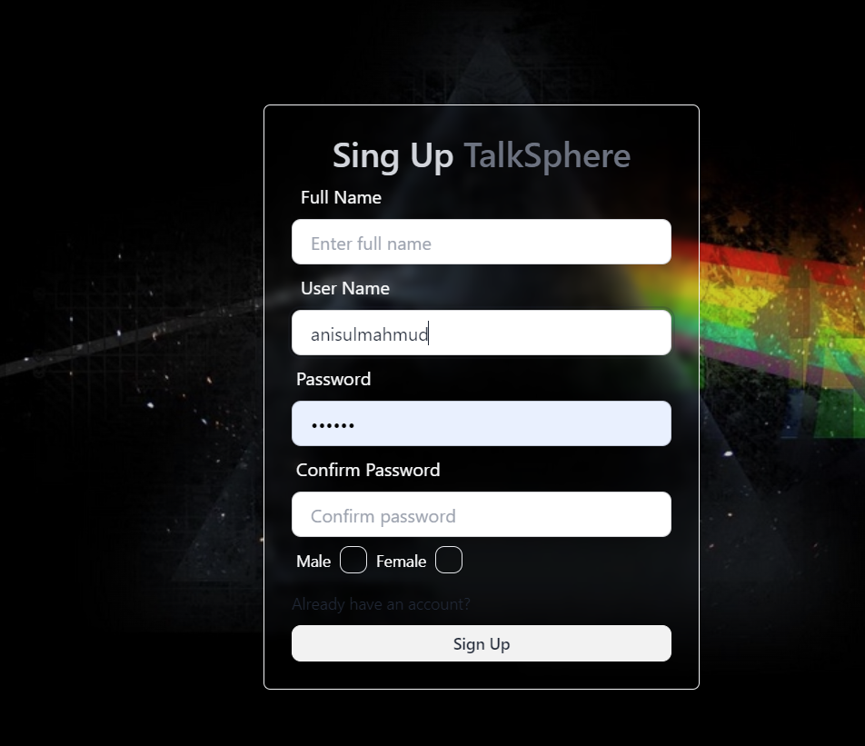
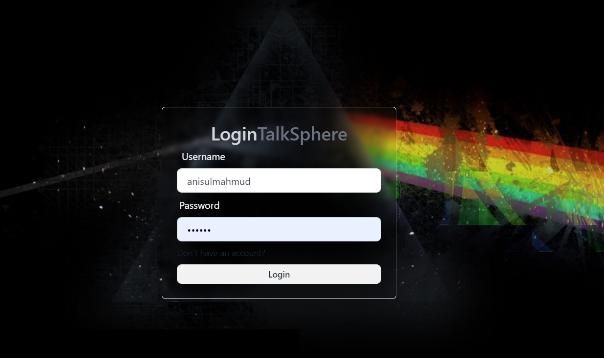

# ChatInfinity

ChatInfinity is a real-time chat web application built using Node.js and React.js. It is a full-stack web application that leverages modern web technologies to provide a seamless and interactive user experience.

## Technologies Used

### Backend
- **Node.js**: A JavaScript runtime built on Chrome's V8 JavaScript engine.
- **Express.js**: A minimal and flexible Node.js web application framework.
- **Socket.io**: A library that enables real-time, bidirectional, and event-based communication.
- **MongoDB**: A NoSQL database for storing chat messages and user information.
- **jsonwebtoken**: A library to work with JSON Web Tokens (JWT) for authentication.

### Frontend
- **React.js**: A JavaScript library for building user interfaces, allowing the creation of reusable UI components.
- **TailwindCSS**: A utility-first CSS framework that provides low-level utility classes for custom designs.
- **daisyUI**: A plugin for TailwindCSS that adds new functionalities and components, enhancing the UI design and user experience.
- **Zustand**: A state management library for React, providing a simple and intuitive way to manage global state.

## Features

- **Real-time Messaging**: Chat with other users in real-time using Socket.io.
- **Authentication**: Secure user authentication using JSON Web Tokens (JWT).
- **Responsive Design**: A responsive and dynamic user interface built with React.js and styled using TailwindCSS and daisyUI.
- **State Management**: Efficient state management using Zustand.
- **Search Functionality**: Easily search for messages and users within the chat application.
- **Registration**: New users can register by providing their details to create an account.
- **Login**: Existing users can log in securely using their credentials.
- **Online Status**: Users can see the online status of other users in real-time.
- **Message Notification Sound**: Users receive an audible notification when a new message arrives.


## ScreenShots:

- **Signup**



- **Log in**



- **HomePage**


- **Live Chating from both end**


## Deployment

This web app is deployed using Render. You can check it out using the following link: 
[ChatInfinity on Render](https://chatinfinity-1.onrender.com)

### Deploying Locally

To deploy this application locally, follow these steps:

1. Clone the Repository:
   ```sh
   git clone https://github.com/AnisulMahmud/ChatInfinity.git
2. Open a terminal for root folder and run -> npm install
3. Then open a terminal for frontned and run -> npm install
4. Create a .env File: In the root folder, create a .env file with the following variables:
   PORT=5000
   MONGO_DB_URI=your_mongodb_connection_string
   JWT_SECRET_TOKEN=your_secret_token
   NODE_ENV=development
5. As this repo has been deployed, you have make changes into SocketContext.jsx file from frontend. 
   Just uncomment the 19 and commented out the line number 21.
6. Build and Start the Application: In the root folder, run the following commands:
   -> npm run build
   -> npm run start
7. Access the Application: Open your browser and navigate to http://localhost:5000. You should now see the application running locally.
