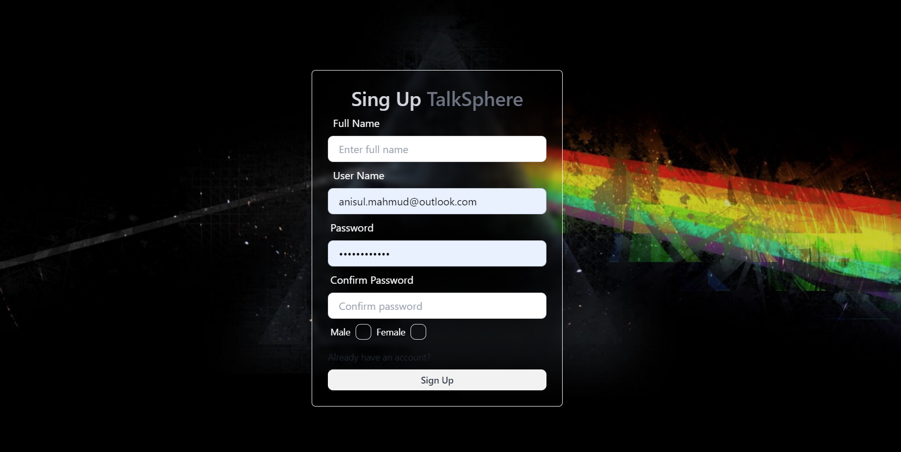
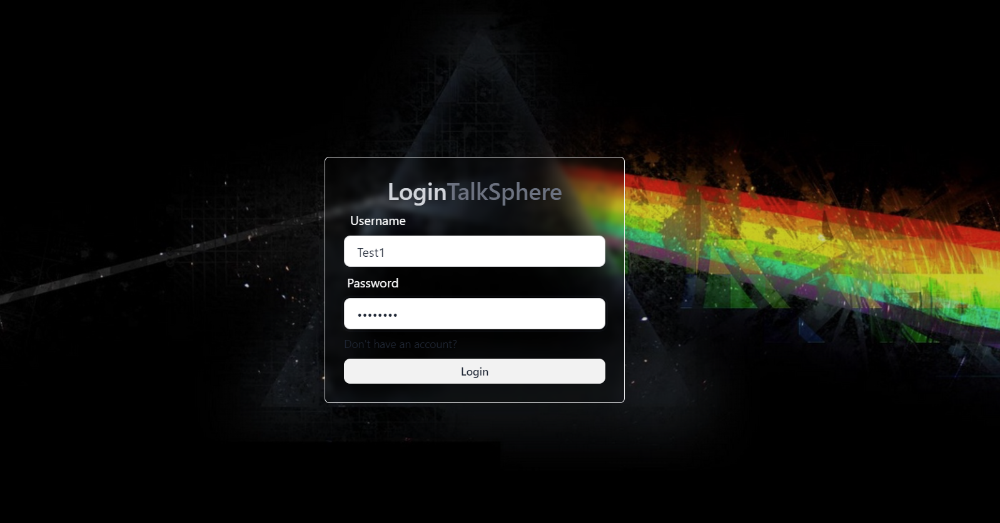
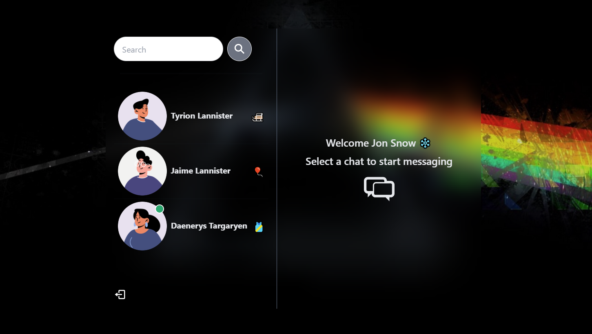
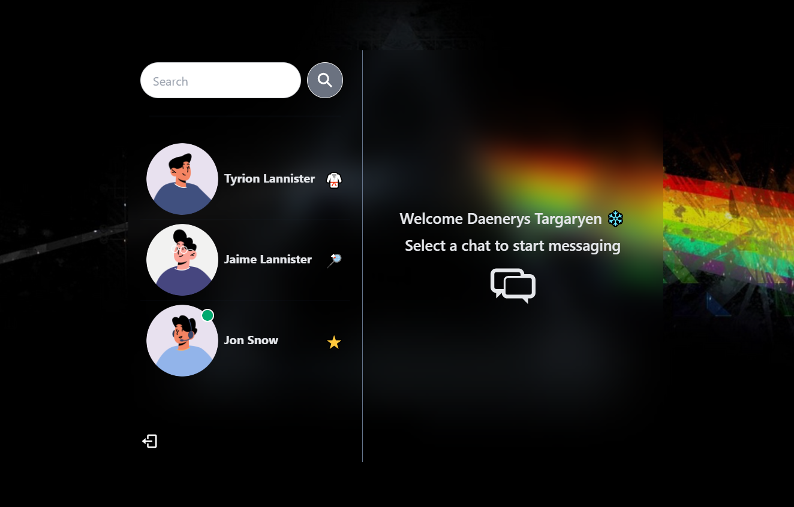
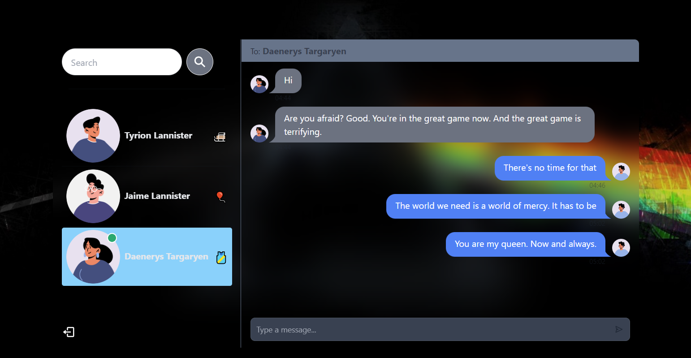
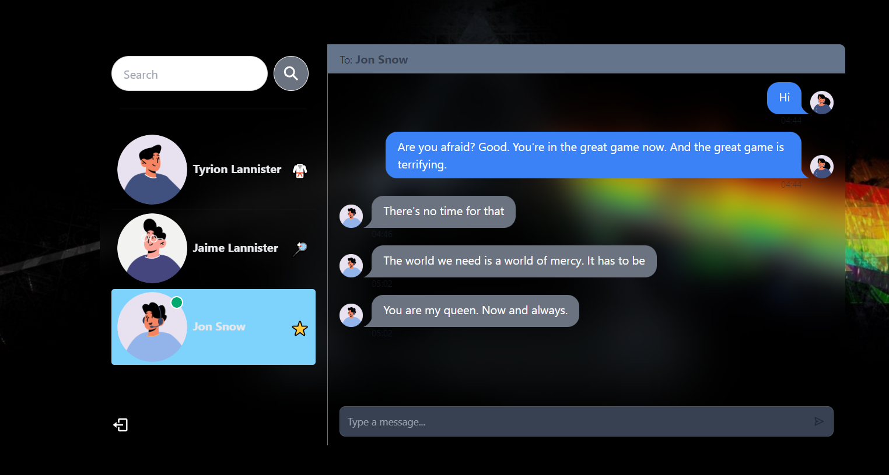

# ChatInfinity

This is a real-time chat web applciation built using NodeJs and ReactJs. It is a Full Stack Web App

soket.io
mongoDb
express and node js
React
daisy UI
jsonwebtoken

Message Model and message controller, to get and sent messages

### Frontend

The frontend of this application is built using the following technologies:

- **ReactJs**: React is a JavaScript library for building user interfaces. It allows us to create reusable UI components. The application uses React to build a dynamic and interactive user interface.

- **TailwindCSS**: TailwindCSS is a utility-first CSS framework. Instead of pre-designed components, Tailwind provides low-level utility classes that let you build completely custom designs. In this application, TailwindCSS is used for styling the components and creating a responsive design.

- **daisyUI**: daisyUI is a plugin for Tailwind CSS that adds new functionalities and components. It extends the utility of TailwindCSS by providing additional components and themes. In this application, daisyUI is used to enhance the UI design and user experience.

- **Zustand**: Zustand is a state management library for React and other JavaScript frameworks. It provides a simple and intuitive way to create and manage global state in a React application. 

Signup

Log in

HomePage

Chating from both side

